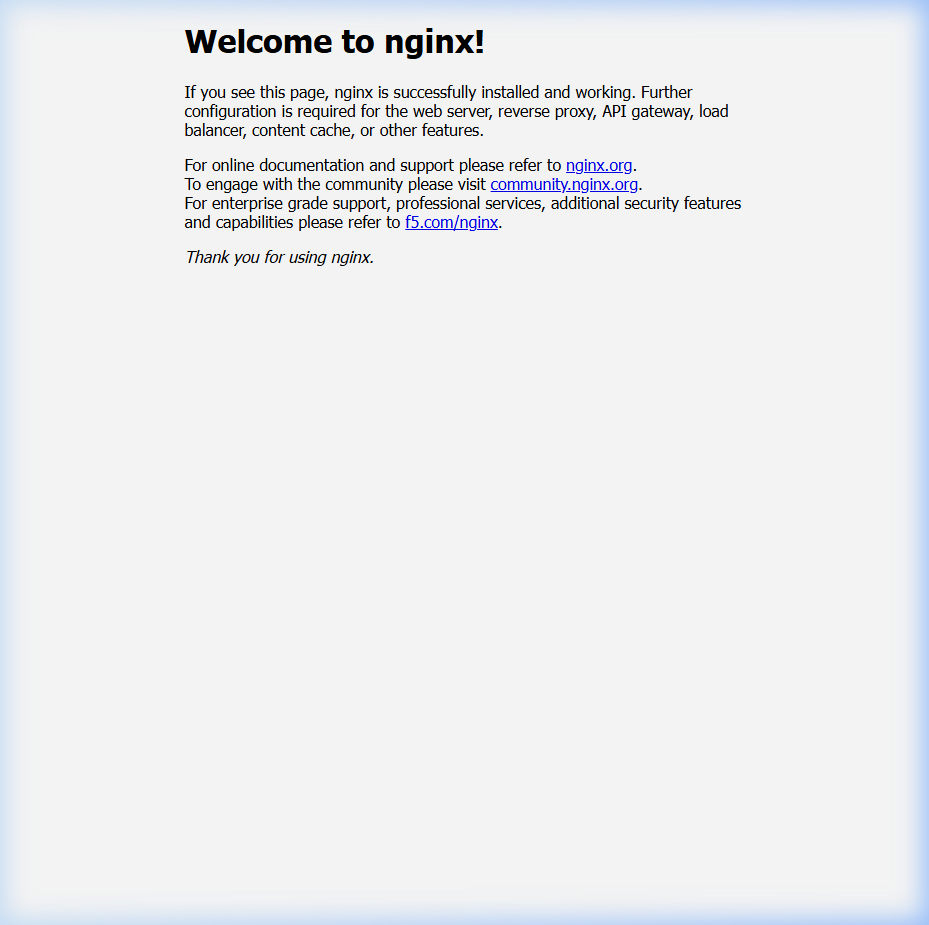

# Отчет по лабораторной работе №3: Основы Docker

**Цель работы:** Изучить основы контейнеризации с помощью Docker: запуск контейнеров, просмотр логов, инспектирование контейнеров, а также написание Dockerfile для Python и Java приложений.

## Ход работы:

### 4.2 Запуск контейнера nginx

Запущен контейнер nginx с проброской порта 8000 (хост) на порт 80 (контейнер). Образ `nginx:latest` был автоматически скачан из Docker Hub при выполнении `docker run`:
```bash
docker run -d --name nginx-lab3 -p 8000:80 nginx
```
- `-d` — запуск в фоновом режиме (detached);
- `--name nginx-lab3` — задает имя контейнера;
- `-p 8000:80` — маппинг порта 8000 хоста на порт 80 контейнера.

Проверяем, что контейнер запущен:
```bash
$ docker ps
CONTAINER ID   IMAGE   COMMAND                  CREATED         STATUS         PORTS                                   NAMES
b4c7a082c54e   nginx   "/docker-entrypoint.…"   41 seconds ago  Up 40 seconds  0.0.0.0:8000->80/tcp, [::]:8000->80/tcp nginx-lab3
```

При обращении по адресу `http://localhost:8000` отображается приветственная страница nginx:



### 4.3 Просмотр логов

Просмотр логов контейнера выполнен командой:
```bash
docker logs nginx-lab3
```

Пример вывода:
```
/docker-entrypoint.sh: /docker-entrypoint.d/ is not empty, will attempt to perform configuration
/docker-entrypoint.sh: Looking for shell scripts in /docker-entrypoint.d/
/docker-entrypoint.sh: Launching /docker-entrypoint.d/10-listen-on-ipv6-by-default.sh
10-listen-on-ipv6-by-default.sh: info: Enabled listen on IPv6 in /etc/nginx/conf.d/default.conf
/docker-entrypoint.sh: Configuration complete; ready for start up
2026/03/23 08:55:13 [notice] 1#1: nginx/1.29.6
2026/03/23 08:55:13 [notice] 1#1: OS: Linux 6.6.87.2-microsoft-standard-WSL2
2026/03/23 08:55:13 [notice] 1#1: start worker processes
172.17.0.1 - - [23/Mar/2026:08:56:36 +0000] "GET / HTTP/1.1" 200 896 "-" "..." "-"
```

При обновлении страницы в браузере в логах появляется новая запись вида:
```
172.17.0.1 - - [23/Mar/2026:08:56:36 +0000] "GET / HTTP/1.1" 200 896 "-" "Mozilla/5.0 ..." "-"
```
Каждый HTTP-запрос фиксируется в access-логе nginx, что позволяет отслеживать обращения к серверу.

### 4.4 Инспектирование контейнера

Полная информация о контейнере получена через `docker inspect`:
```bash
docker inspect nginx-lab3
```

С помощью фильтрации `--format` (аналог использования `jq`) получены ключевые параметры:

| Параметр | Команда | Значение |
|---|---|---|
| Статус | `docker inspect nginx-lab3 --format "{{.State.Status}}"` | `running` |
| IP-адрес | `docker inspect nginx-lab3 --format "{{.NetworkSettings.Networks.bridge.IPAddress}}"` | `172.17.0.2` |
| Образ | `docker inspect nginx-lab3 --format "{{.Config.Image}}"` | `nginx` |
| Порты | `docker inspect nginx-lab3 --format "{{.HostConfig.PortBindings}}"` | `map[80/tcp:[{ 8000}]]` |

Пример использования `jq` (в Linux/WSL):
```bash
docker inspect nginx-lab3 | jq -r '.[0].NetworkSettings.Networks.bridge.IPAddress'
# Вывод: 172.17.0.2

docker inspect nginx-lab3 | jq -r '.[0].State.Status'
# Вывод: running
```

### 4.5 Dockerfile для Python приложения

Создано простое Flask-приложение со следующей структурой:

**app.py:**
```python
from flask import Flask

app = Flask(__name__)

@app.route('/')
def hello():
    return '<h1>Hello from Python Flask App!</h1><p>Running inside Docker container.</p>'

if __name__ == '__main__':
    app.run(host='0.0.0.0', port=5000)
```

**requirements.txt:**
```
flask==3.0.0
```

**Dockerfile:**
```dockerfile
FROM python:3.12-slim

WORKDIR /app

COPY requirements.txt .
RUN pip install --no-cache-dir -r requirements.txt

COPY app.py .

EXPOSE 5000

CMD ["python", "app.py"]
```

Описание инструкций:
- `FROM python:3.12-slim` — базовый образ с Python 3.12 (slim-версия для минимального размера);
- `WORKDIR /app` — рабочая директория внутри контейнера;
- `COPY requirements.txt .` + `RUN pip install ...` — копирование зависимостей и их установка (отдельный слой для кэширования);
- `COPY app.py .` — копирование кода приложения;
- `EXPOSE 5000` — объявление порта приложения;
- `CMD ["python", "app.py"]` — команда запуска.

Сборка и запуск:
```bash
docker build -t python-app ./python
docker run -d --name python-lab3 -p 5000:5000 python-app
```

Проверка: при обращении на `http://localhost:5000` отображается приветственная страница Flask-приложения.

### 4.6 Dockerfile для Java приложения

Создан простой HTTP-сервер на Java:

**Main.java:**
```java
import com.sun.net.httpserver.HttpServer;
import com.sun.net.httpserver.HttpHandler;
import com.sun.net.httpserver.HttpExchange;
import java.io.IOException;
import java.io.OutputStream;
import java.net.InetSocketAddress;

public class Main {
    public static void main(String[] args) throws IOException {
        HttpServer server = HttpServer.create(new InetSocketAddress(8080), 0);
        server.createContext("/", exchange -> {
            String response = "<h1>Hello from Java App!</h1><p>Running inside Docker container.</p>";
            exchange.sendResponseHeaders(200, response.getBytes().length);
            OutputStream os = exchange.getResponseBody();
            os.write(response.getBytes());
            os.close();
        });
        server.start();
        System.out.println("Server started on port 8080");
    }
}
```

**Dockerfile:**
```dockerfile
FROM eclipse-temurin:17-jdk

WORKDIR /app

COPY Main.java .

RUN javac Main.java

EXPOSE 8080

CMD ["java", "Main"]
```

Описание инструкций:
- `FROM eclipse-temurin:17-jdk` — базовый образ с JDK 17 (Eclipse Temurin);
- `RUN javac Main.java` — компиляция Java-кода на этапе сборки образа;
- `EXPOSE 8080` — объявление порта;
- `CMD ["java", "Main"]` — запуск скомпилированного класса.

Сборка и запуск:
```bash
docker build -t java-app ./java
docker run -d --name java-lab3 -p 8080:8080 java-app
```

Все три контейнера работают одновременно:
```
CONTAINER ID   IMAGE        COMMAND                  PORTS                                         NAMES
6c2f7190c1a4   java-app     "/__cacert_entrypoin…"   0.0.0.0:8080->8080/tcp, [::]:8080->8080/tcp   java-lab3
273d14af0efb   python-app   "python app.py"          0.0.0.0:5000->5000/tcp, [::]:5000->5000/tcp   python-lab3
b4c7a082c54e   nginx        "/docker-entrypoint.…"   0.0.0.0:8000->80/tcp, [::]:8000->80/tcp       nginx-lab3
```

## 5. Контрольные вопросы

### 1. Что такое Docker?
Docker — это платформа для контейнеризации приложений, позволяющая упаковывать приложение со всеми его зависимостями в стандартизированный блок (контейнер). Docker использует технологии ядра Linux (namespaces, cgroups) для изоляции процессов, обеспечивая легковесную виртуализацию без необходимости полноценной гостевой ОС.

### 2. Что такое образ?
Образ (Image) — это неизменяемый шаблон, содержащий файловую систему, код приложения, зависимости и метаданные. Образ состоит из слоёв (layers), каждый из которых представляет инструкцию Dockerfile. Образы хранятся в реестрах (registry), таких как Docker Hub.

### 3. Что такое контейнер?
Контейнер — это запущенный экземпляр образа. Контейнер представляет собой изолированный процесс с собственной файловой системой (копия-при-записи поверх слоёв образа), сетевым стеком и пространством процессов. В отличие от образа, контейнер имеет изменяемый слой и состояние (running, stopped, paused и т.д.).

### 4. Причина ошибки при втором запуске контейнера
На рисунке показан образ с файлом `main.py`, который по умолчанию выводит `"Hello, World!"`, но может принимать аргумент для замены слова `"World"`. При втором запуске контейнера произошла ошибка, вероятнее всего, из-за попытки запустить контейнер с тем же именем (`--name`), что и у уже существующего (но остановленного) контейнера. Docker не позволяет создать два контейнера с одинаковым именем.

**Способы устранения:**
1. Удалить старый контейнер: `docker rm <имя_контейнера>`;
2. Использовать другое имя при запуске;
3. Использовать флаг `--rm` для автоматического удаления контейнера после остановки: `docker run --rm <образ>`.

## Вывод:
В ходе лабораторной работы были освоены основные навыки работы с Docker: запуск контейнеров из готовых образов (nginx), просмотр логов, инспектирование контейнеров для получения детальной информации, а также написание собственных Dockerfile для Python (Flask) и Java приложений. Все контейнеры были успешно собраны, запущены и протестированы.
