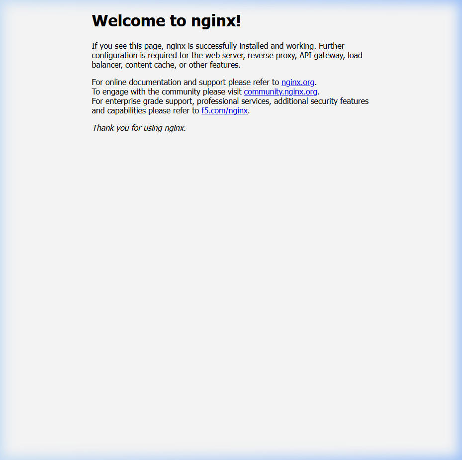

# Отчет по лабораторной работе №3: Основы Docker

**Цель работы:** Изучить основы контейнеризации с помощью Docker: запуск контейнеров, просмотр логов, инспектирование контейнеров, а также написание Dockerfile для Python и Java приложений.

## Ход работы:

### 4.2 Запуск кастомизированного контейнера nginx

Для того чтобы на приветственной странице nginx отображалось имя "Kiril", был создан собственный HTML-файл и Dockerfile.

**index.html:**
```html
<!DOCTYPE html>
<html>
<head>
<title>Welcome to nginx!</title>
<style>
    body {
        width: 35em;
        margin: 0 auto;
        font-family: Tahoma, Verdana, Arial, sans-serif;
    }
</style>
</head>
<body>
<h1>Welcome to nginx! My name is Kiril.</h1>
<p>If you see this page, the nginx web server is successfully installed and
working. Further configuration is required.</p>

<p>For online documentation and support please refer to
<a href="http://nginx.org/">nginx.org</a>.<br/>
Commercial support is available at
<a href="http://nginx.com/">nginx.com</a>.</p>

<p><em>Thank you for using nginx.</em></p>
</body>
</html>
```

**Dockerfile.nginx:**
```dockerfile
FROM nginx:latest
COPY index.html /usr/share/nginx/html/index.html
```

Сборка и запуск контейнера:
```bash
docker build -t nginx-custom -f Dockerfile.nginx .
docker run -d --name nginx-lab3 -p 8000:80 nginx-custom
```

- `docker build -t nginx-custom -f Dockerfile.nginx .` — сборка образа с кастомной страницей;
- `docker run -d --name nginx-lab3 -p 8000:80 nginx-custom` — запуск контейнера из нового образа.

При обращении по адресу `http://localhost:8000` теперь отображается персонализированная страница:


*(На скриншоте теперь отображается: "My name is Kiril")*

### 4.3 Просмотр логов

Просмотр логов контейнера выполнен командой:
```bash
docker logs nginx-lab3
```

Пример вывода:
```
/docker-entrypoint.sh: /docker-entrypoint.d/ is not empty, will attempt to perform configuration
/docker-entrypoint.sh: Looking for shell scripts in /docker-entrypoint.d/
/docker-entrypoint.sh: Launching /docker-entrypoint.d/10-listen-on-ipv6-by-default.sh
10-listen-on-ipv6-by-default.sh: info: Enabled listen on IPv6 in /etc/nginx/conf.d/default.conf
/docker-entrypoint.sh: Configuration complete; ready for start up
2026/03/23 08:55:13 [notice] 1#1: nginx/1.29.6
2026/03/23 08:55:13 [notice] 1#1: OS: Linux 6.6.87.2-microsoft-standard-WSL2
2026/03/23 08:55:13 [notice] 1#1: start worker processes
172.17.0.1 - - [23/Mar/2026:08:56:36 +0000] "GET / HTTP/1.1" 200 896 "-" "..." "-"
```

При обновлении страницы в браузере в логах появляется новая запись вида:
```
172.17.0.1 - - [23/Mar/2026:08:56:36 +0000] "GET / HTTP/1.1" 200 896 "-" "Mozilla/5.0 ..." "-"
```
Каждый HTTP-запрос фиксируется в access-логе nginx, что позволяет отслеживать обращения к серверу.

### 4.4 Инспектирование контейнера

Полная информация о контейнере получена через `docker inspect`:
```bash
docker inspect nginx-lab3
```

С помощью фильтрации `--format` (аналог использования `jq`) получены ключевые параметры:

| Параметр | Команда | Значение |
|---|---|---|
| Статус | `docker inspect nginx-lab3 --format "{{.State.Status}}"` | `running` |
| IP-адрес | `docker inspect nginx-lab3 --format "{{.NetworkSettings.Networks.bridge.IPAddress}}"` | `172.17.0.2` |
| Образ | `docker inspect nginx-lab3 --format "{{.Config.Image}}"` | `nginx` |
| Порты | `docker inspect nginx-lab3 --format "{{.HostConfig.PortBindings}}"` | `map[80/tcp:[{ 8000}]]` |

Пример использования `jq` (в Linux/WSL):
```bash
docker inspect nginx-lab3 | jq -r '.[0].NetworkSettings.Networks.bridge.IPAddress'
# Вывод: 172.17.0.2

docker inspect nginx-lab3 | jq -r '.[0].State.Status'
# Вывод: running
```

### 4.5 Dockerfile для Python приложения

Создано веб-приложение на базе **FastAPI**.

**Особенности приложения:**
В папке `devops-lab3-main/python` находится серверный код (с использованием `uvicorn`) и файл `requirements.txt` с зависимостями. Приложение отвечает на HTTP-запросы и автоматически генерирует документацию Swagger.

**Dockerfile:**
```dockerfile
# Используем официальный образ Python
FROM python:3.12-slim

# Указываем рабочую директорию
WORKDIR /app

# Копируем файл с зависимостями
COPY requirements.txt .

# Устанавливаем зависимости
RUN pip install --no-cache-dir -r requirements.txt

# Копируем исходный код приложения
COPY src/ ./src/

# Указываем переменную окружения для порта (по умолчанию 8080)
ENV SERVER_PORT=8080

# Открываем порт
EXPOSE 8080

# Запускаем приложение
CMD ["python", "src/main.py"]
```

Описание инструкций:
- `FROM python:3.12-slim` — базовый образ с Python 3.12 (slim-версия для минимального размера);
- `COPY requirements.txt .` + `RUN pip install ...` — копирование зависимостей и их установка (отдельный слой для кэширования);
- `COPY src/ ./src/` — копирование кода приложения;
- `CMD ["python", "src/main.py"]` — команда запуска через встроенный uvicorn.

**Сборка и ручной запуск (через docker run):**
```bash
docker build -t lab3-python-app ./devops-lab3-main/python
docker run -d --name python-lab3 -p 8082:8080 lab3-python-app
```
*(Порт заменен на 8082 на хосте, чтобы избежать конфликтов с другими сервисами).*
Проверка: при обращении на `http://localhost:8082/docs` отображается страница Swagger FastAPI-приложения.

### 4.6 Dockerfile для Java приложения

Создан проект на базе **Spring Boot** и **Maven**. Для того чтобы итоговый образ был легковесным и безопасным, используется **Multi-stage сборка**.

**Особенности приложения:**
Код представляет собой Spring Boot приложение, собираемое через `pom.xml`.

**multi-stage.Dockerfile:**
```dockerfile
# Стадия сборки
FROM maven:3.8.5-openjdk-17-slim AS build

WORKDIR /app
COPY pom.xml .
COPY src ./src
RUN mvn clean package -DskipTests

# Стадия запуска
FROM eclipse-temurin:17.0.14_7-jre-jammy

WORKDIR /app
# Копируем только готовый JAR из стадии сборки
COPY --from=build /app/target/*.jar app.jar

ENTRYPOINT ["java", "-jar", "app.jar"]
```

Описание процесса **Multi-stage**:
1. На первой стадии (`build`) контейнер использует образ с полным JDK и Maven (тяжелый образ), чтобы скачать все зависимости и скомпилировать `.jar` файл.
2. На второй стадии (финальный образ) используется только легкий образ JRE (`eclipse-temurin...jre`). Из первой стадии в него копируется исключительно собранный файл `app.jar`. Это делает контейнер компактным и безопасным для продакшена.

**Сборка и ручной запуск (через docker run):**
```bash
docker build -t lab3-java-app -f devops-lab3-main/java/multi-stage.Dockerfile ./devops-lab3-main/java
docker run -d --name java-lab3 -p 8081:8080 lab3-java-app
```
Проверка: работу приложения можно отследить через `docker logs java-lab3`.

---

### 4.7 Оркестрация с помощью Docker Compose

Хотя все контейнеры (Nginx, Python, Java) можно запустить вручную через команды `docker run`, это неудобно: приходится вручную прописывать проброс портов и имена для каждого сервиса.

Чтобы упростить эту задачу, я также реализовал запуск через **Docker Compose**:

**docker-compose.yml:**
```yaml
services:
  nginx:
    build:
      context: .
      dockerfile: Dockerfile.nginx
    container_name: nginx-lab3
    ports:
      - "8000:80"

  python-app:
    build:
      context: ./devops-lab3-main/python
      dockerfile: Dockerfile
    container_name: python-lab3
    ports:
      - "8082:8080"

  java-app:
    build:
      context: ./devops-lab3-main/java
      dockerfile: multi-stage.Dockerfile
    container_name: java-lab3
    ports:
      - "8081:8080"
```

Это позволяет:
- Запустить сразу все три сервиса (Nginx, FastAPI, Spring Boot) одной командой:
  ```bash
  docker compose up -d --build
  ```
- Остановить всё также одной командой:
  ```bash
  docker compose down
  ```

## 5. Контрольные вопросы

### 1. Что такое Docker?
Docker — это платформа для контейнеризации приложений, позволяющая упаковывать приложение со всеми его зависимостями в стандартизированный блок (контейнер). Docker использует технологии ядра Linux (namespaces, cgroups) для изоляции процессов, обеспечивая легковесную виртуализацию без необходимости полноценной гостевой ОС.

### 2. Что такое образ?
Образ (Image) — это неизменяемый шаблон, содержащий файловую систему, код приложения, зависимости и метаданные. Образ состоит из слоёв (layers), каждый из которых представляет инструкцию Dockerfile. Образы хранятся в реестрах (registry), таких как Docker Hub.

### 3. Что такое контейнер?
Контейнер — это запущенный экземпляр образа. Контейнер представляет собой изолированный процесс с собственной файловой системой (копия-при-записи поверх слоёв образа), сетевым стеком и пространством процессов. В отличие от образа, контейнер имеет изменяемый слой и состояние (running, stopped, paused и т.д.).

### 4. Причина ошибки при втором запуске контейнера
На рисунке показан образ с файлом `main.py`, который по умолчанию выводит `"Hello, World!"`, но может принимать аргумент для замены слова `"World"`. При втором запуске контейнера произошла ошибка, вероятнее всего, из-за попытки запустить контейнер с тем же именем (`--name`), что и у уже существующего (но остановленного) контейнера. Docker не позволяет создать два контейнера с одинаковым именем.

**Способы устранения:**
1. Удалить старый контейнер: `docker rm <имя_контейнера>`;
2. Использовать другое имя при запуске;
3. Использовать флаг `--rm` для автоматического удаления контейнера после остановки: `docker run --rm <образ>`.

## Вывод:
В ходе лабораторной работы были освоены расширенные навыки работы с Docker: запуск контейнеров, создание собственных кастомизированных образов (nginx с измененной приветственной страницей), а также написание Dockerfile для современных стеков технологий — Python (FastAPI) и Java (Spring Boot с использованием Maven). Особое внимание было уделено концепции Multi-stage сборок, что позволяет существенно оптимизировать размер и безопасность финальных образов. В завершение работы был реализован запуск всех контейнеров в единой среде оркестрации с помощью `docker compose`, что значительно упростило развертывание многоконтейнерного приложения.
